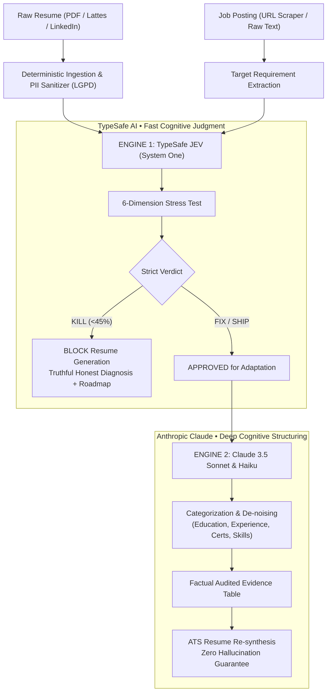

<div align="center">

**🌐 Language / Idioma:** [🇺🇸 English](README.md) • [🇧🇷 Português do Brasil](README.pt-BR.md)

</div>

# 📄 SmartVitae

> **Factual Career Alignment & Resume Adaptation Platform with Zero AI Hallucinations.**  
> Combining **TypeSafe JEV** (System One fast cognitive judgments) and **Claude 3.5 Sonnet** to stress-test professional candidacy, audit factual career evidences, and prevent fabricated credentials.

<div align="center">

[-emerald?style=for-the-badge&logo=render)](https://nexovitae.onrender.com)

[](https://opensource.org/licenses/MIT)


</div>

> 🚀 **Explore Without Registration**: Anyone visiting the project can immediately test and navigate the full application with real-world resumes, job postings, multidimensional stress tests, and factual resume adaptations by visiting **[Live Demo](https://nexovitae.onrender.com)**.

---

## 👨‍⚕️ Why I Built This

During my work as a physician and researcher at the intersection of healthcare and technology, I noticed a dangerous trend in how generative AI is applied to career transitions and recruitment.

When candidates feed their resume and a target job description into conventional LLM chatbots (e.g., standard ChatGPT or generic resume generators), the AI behaves like an over-eager sycophant:
1. It yields **false optimism**, asserting a "95% match" even when a clinical doctor applies for an enterprise automobile sales manager position;
2. It **fabricates clinical credentials**, inventing medical license registrations (CRM), specialist certificates (RQE), or fictitious hospital tenures out of thin air to bridge qualifications;
3. In regulated professions (Medicine, Law, Engineering), presenting a fabricated credential is not just grounds for immediate job rejection—it is an **ethical crime and grounds for license revocation** under Medical Council regulations (CFM Resolution nº 2.336/2023).

> *How can an AI accurately tell a professional the unvarnished truth about their real job fit, rigorously lock down their verifiable career facts, and adapt their resume without inventing a single word?*

**SmartVitae** was engineered to solve this dilemma. It acts as an impartial, factual career guardian built upon a **Dual-Engine AI Architecture**: fast sensory judgment via **TypeSafe JEV (System One)** and deep cognitive structuring via **Claude 3.5 Sonnet (System Two)**.

---

## 🩺 The Career & Credential Problem

In competitive job markets and specialized industries, professionals face distinct challenges:
- **Unverified ATS Tailoring**: Conventional resume builders encourage keyword stuffing, prompting LLMs to hallucinate years of experience, tools never touched, and leadership scopes never held.
- **Wasted Time & Disillusionment**: Applying to jobs where fundamental qualifications are absent damages candidate credibility and consumes recruiter time.
- **Regulatory Penalties in Regulated Markets**: Under Brazilian Federal Council of Medicine (CFM) resolutions, announcing titles or specialties without an accredited RQE (*Registro de Qualificação de Especialista*) violates medical ethics.
- **Fragmented Evidence Silos**: A professional's true accomplishments reside across scattered PDFs, diplomas, university transcripts, Lattes CVs, and LinkedIn records, with no single auditable system of record.

---

## 💡 Product Hypothesis

> If a candidate's credentials are first anchored into an **auditable evidence database** and then submitted to an **uncompromising multidimensional stress-test** (modeled after *Kill My Idea* principles), we can instantly filter unfeasible candidacies (`KILL`), identify actionable bridge requirements (`FIX`), and craft high-impact, truthful ATS resumes (`SHIP`) with **100% factual grounding**.

---

## 🤖 Dual-Engine AI Architecture

SmartVitae decouples fast, deterministic judgment from complex linguistic generation:



### 1. Engine 1: TypeSafe JEV (System One Fast Judgment)
- Evaluates factual correlation across **6 core dimensions** on a 0 to 4 TypeSafe scale:
  1. **Profession & Core Background Fit** (`profession_fit`): Verifies if foundational education overlaps with the job scope.
  2. **Mandatory Skills Backing** (`mandatory_skills`): Audits documentary evidence for each prerequisite.
  3. **Daily Routine Overlap** (`daily_activities`): Evaluates hands-on history in the day-to-day duties.
  4. **Fabrication Risk** (`fabrication_risk`): Flags whether tailoring would require inventing facts.
  5. **Industry & Ecosystem Fit** (`industry_fit`): Measures sector familiarity (e.g., healthcare vs. retail).
  6. **Depth of Experience** (`experience_depth`): Evaluates seniority against expectations.
- **Strict Verdicts**:
  - `KILL`: Radical mismatch (e.g., Physician applying to Car Salesperson). Resume generation is **actively blocked** to protect candidate reputation. A realistic career roadmap is provided instead.
  - `FIX`: Transferable skills with critical gaps. Highlights exact missing skills and allows the candidate to upload supporting certificates or declare absence.
  - `SHIP`: High factual alignment. Cleared for tailored resume generation.

### 2. Engine 2: Claude 3.5 Sonnet & Haiku (System Two Cognitive Structuring)
- **Zero-Noise Parsing**: Cleans fragmented text, removing headers and disjointed sentences.
- **Categorical Schema**: Structures verified data into 8 official sections:
  `formacao`, `experiencia`, `idiomas`, `habilidades`, `certificacoes`, `cursos`, `projetos`, `publicacoes`.
- **ATS Resume Synthesis**: Crafts a single-column, ATS-optimized executive resume where **every single bullet point is linked to an auditable `evidence_id`**.

---

## 🛡️ Anti-Hallucination & Medical Governance

SmartVitae adheres to strict ethical and data privacy baselines:
- **CFM Resolution nº 2.336/2023 & Medical Advertising**: Strictly prohibits claiming specialties without a verified RQE number.
- **Human-in-the-Loop & Audit Locks (`user_locked`)**: Once approved or manually adjusted by the candidate, an evidence item cannot be overwritten by automated runs.
- **Source Excerpt Grounding**: Every card displays the exact original quotation (`source_excerpt`) extracted from the candidate's PDF or LinkedIn profile.
- **LGPD by Design (Brazilian General Data Protection Law)**: Sensitive PII (national IDs, CPF, RG, patient names) are sanitized client-side and server-side before contacting any external AI endpoint.

---

## 📱 Mobile-First Responsive Design

Engineered with a responsive architecture tested across mobile viewports (360px – 430px) and large displays:
- **Fluid Container Bounds**: Zero horizontal overflow (`overflow-x: hidden`, `max-width: 100vw`).
- **Native Bottom Navigation Bar**: Instant mobile access to `Início`, `Documentos`, and `Evidências`.
- **Adaptive Gauges & Data Tables**: Responsive metrics widgets and scrollable evidence tables designed for touchscreen ergonomics.
- **Custom Vector Branding**: Modern `SV` logo incorporating a folded resume corner, vital pulse wave, and validation checkmark.

---

## 🗺️ Key Features & Workflow

1. **Two-Step Landing Page**:
   - Step 1: Upload resume PDF, LinkedIn profile PDF, or paste text. (Includes a *"Don't have a resume ready?"* guided onboarding).
   - Step 2: Input job posting URL (supports LinkedIn Jobs, Gupy, hospital portals) or paste job requirements.
2. **Stress-Test Diagnosis Screen**:
   - Radial adherence score, verdict badge, honest diagnosis, 6-dimension progress bars, critical gaps, and learning roadmap.
3. **Interactive Gap Resolution**:
   - Directly upload supplementary certificates to prove required qualifications or click *"I do not possess this experience"* to instruct the AI to emphasize other authentic strengths.
4. **Structured Evidence Database**:
   - Filter and search verified qualifications across all 8 career categories.
   - On-demand re-filtering via Claude.
5. **ATS Resume Restructuring**:
   - Generates an executive, ATS-ready resume formatted for single-click copying or downloading.

---

## 🛠️ Tech Stack

- **Framework**: Next.js 15 (App Router), React 19, TypeScript 5.7
- **Styling**: Tailwind CSS, Lucide React icons
- **Decision Engine (System One)**: TypeSafe AI JEV API (`jev-latest`)
- **Cognitive Engine (System Two)**: Anthropic Claude 3.5 Sonnet & Claude Haiku 4.5 via OpenRouter
- **Document Processing**: `unpdf` (secure local PDF text extraction)
- **Testing**: Vitest (16 automated tests covering decisions, sanitizers, and normalizers)
- **Deployment**: Render Web Service & Docker multi-stage build

---

## 🚀 Local Development Setup

### Prerequisites
- [Node.js](https://nodejs.org/) (v18+)
- `npm` or `pnpm`

### Setup Instructions

1. **Clone the repository:**
   ```bash
   git clone https://github.com/rafaelleaomed/smartvitae.git
   cd smartvitae
   ```

2. **Install dependencies:**
   ```bash
   npm install
   ```

3. **Configure Environment:**
   Create a `.env.local` file in the root directory:
   ```env
   # TypeSafe AI / JEV
   ENABLE_JEV=true
   TYPESAFE_API_KEY=your_typesafe_api_key_here
   TYPESAFE_MODEL=jev-latest

   # OpenRouter / Claude
   OPENROUTER_API_KEY=your_openrouter_api_key_here

   # App URL
   NEXT_PUBLIC_APP_URL=http://localhost:3000
   ```

4. **Run Automated Tests:**
   ```bash
   npm test
   ```

5. **Start Development Server:**
   ```bash
   npm run dev
   ```
   Open [http://localhost:3000](http://localhost:3000) in your browser.

---

## 👨‍💻 Author

**Rafael Leão, MD**  
*Physician exploring AI in healthcare, digital health products, and clinical AI governance.*  
- **GitHub**: [@rafaelleaomed](https://github.com/rafaelleaomed)  
- **LinkedIn**: [rafaelleaomed](https://linkedin.com/in/rafaelleaomed)
