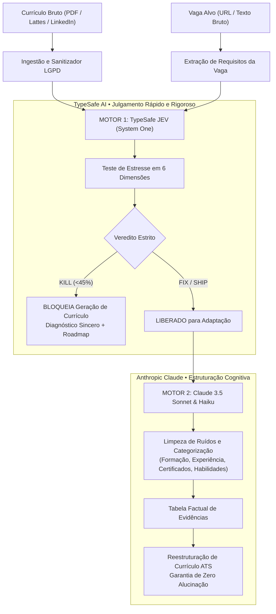

<div align="center">

**🌐 Language / Idioma:** [🇺🇸 English](README.md) • [🇧🇷 Português do Brasil](README.pt-BR.md)

</div>

# 📄 SmartVitae

> **Plataforma de Adequação Curricular Factual e Alinhamento de Carreira com Zero Alucinação de IA.**  
> Combinando **TypeSafe JEV** (Julgamento cognitivo rápido System One) e **Claude 3.5 Sonnet** para submeter candidaturas a testes de estresse implacáveis, auditar evidências documentais e eliminar a invenção de qualificações.

<div align="center">

[-emerald?style=for-the-badge&logo=render)](https://nexovitae.onrender.com)

[](https://opensource.org/licenses/MIT)


</div>

> 🚀 **Explore Sem Cadastro**: Qualquer visitante pode testar e navegar por toda a plataforma utilizando currículos reais, links de vagas, diagnósticos multidimensionais de estresse e reestruturação factual de currículo acessando o **[Live Demo](https://nexovitae.onrender.com)**.

---

## 👨‍⚕️ Por Que Construí Isto

Durante minha atuação como médico e pesquisador na fronteira entre saúde e tecnologia, testemunhei um padrão alarmante no uso de inteligência artificial generativa aplicada a recrutamento e transição de carreira.

Quando candidatos enviam seus currículos e anúncios de vagas para LLMs comerciais convencionais (como ChatGPT básico ou geradores automáticos de currículo), a IA se comporta de forma aduladora e perigosa:
1. Oferece **falsas esperanças**, declarando "95% a 100% de aderência" até mesmo quando um médico generalista se candidata para uma vaga de gerente de vendas de concessionária de veículos;
2. **Alucina credenciais clínicas e profissionais**, inventando números de CRM, títulos de especialista (RQE), hospitais ou anos de experiência inexistentes para "forçar" um encaixe na vaga;
3. Em profissões regulamentadas (Medicina, Direito, Engenharia), apresentar uma qualificação fictícia perante um contratante não resulta apenas em eliminação imediata — constitui **infração ética gravíssima e risco de processo disciplinar perante o Conselho Federal de Medicina (Resolução CFM nº 2.336/2023)**.

> *Como construir uma IA capaz de dizer a verdade nua e crua ao profissional sobre sua aderência real à vaga, blindar seus fatos documentados e adaptar seu currículo sem inventar uma única linha?*

O **SmartVitae** nasceu para resolver essa lacuna. Ele opera como um guardião factual de carreira fundamentado em uma **Arquitetura de Inteligência Artificial de Motor Duplo**: julgamento rápido e implacável via **TypeSafe JEV (System One)** e síntese cognitiva de alta precisão via **Claude 3.5 Sonnet (System Two)**.

---

## 🩺 O Problema: LLMs Sem Freios e Qualificações Fabricadas

No mercado de trabalho competitivo e altamente especializado, profissionais enfrentam armadilhas crônicas:
- **Adaptação Cega para ATS**: Plataformas convencionais encorajam preenchimento artificial de palavras-chave, induzindo a IA a fabricar anos de experiência, ferramentas jamais utilizadas e escopos de liderança falsos.
- **Desgaste e Perda de Tempo**: Submeter candidaturas para vagas onde requisitos fundamentais inexistem destrói a reputação do candidato e sobrecarrega os recrutadores.
- **Risco Ético e Regulatório**: Segundo normas do CFM e de conselhos de classe no Brasil, autointitular-se especialista sem RQE é expressamente vedado.
- **Silos Fragmentados de Conquistas**: As realizações reais do profissional residem dispersas em PDFs, diplomas, certificados de congressos, currículos Lattes e perfis do LinkedIn, sem uma base central auditável.

---

## 💡 Hipótese do Produto

> Se as credenciais de um profissional forem primeiramente ancoradas em uma **base auditável de evidências reais** e submetidas a um **teste de estresse implacável** (inspirado no rigor do *Kill My Idea*), podemos filtrar candidaturas inviáveis (`KILL`), orientar o preenchimento de lacunas reais (`FIX`) e gerar currículos ATS de alto impacto (`SHIP`) com **100% de respaldo factual**.

---

## 🤖 Arquitetura de IA de Motor Duplo

O SmartVitae separa o julgamento rápido determinístico da reestruturação linguística profunda:



### 1. Motor 1: TypeSafe JEV (System One — Julgamento Rápido)
- Avalia a correlação factual em **6 dimensões rigorosas** (notas de 0 a 4 na escala TypeSafe):
  1. **Aderência Profissional e Formação Base** (`profession_fit`): Analisa se a carreira de origem é compatível com o cargo pretendido.
  2. **Requisitos Obrigatórios Comprovados** (`mandatory_skills`): Audita se os pré-requisitos essenciais possuem respaldo no histórico.
  3. **Rotinas Práticas do Cargo** (`daily_activities`): Avalia se o profissional já exerceu tarefas semelhantes.
  4. **Segurança Ética (Risco de Invenção de Fatos)** (`fabrication_risk`): Mede o risco de alucinação e fabricação.
  5. **Fit com a Indústria e Ecossistema** (`industry_fit`): Avalia a familiaridade com o setor (ex: saúde vs. varejo).
  6. **Profundidade de Experiência** (`experience_depth`): Mede a maturidade da carreira em relação à senioridade exigida.
- **Vereditos Implacáveis**:
  - `KILL`: Incompatibilidade estrutural (ex: Médico para Vendedor de Automóveis). A geração do currículo adaptado é **bloqueada pelo sistema** para proteger a credibilidade do candidato, entregando um roadmap realista de capacitação.
  - `FIX`: Competências parcialmente transferíveis com lacunas claras. O sistema aponta exatamente o que falta e permite enviar certificados ou declarar a ausência do requisito.
  - `SHIP`: Candidatura altamente viável e comprovada. Liberado para confecção imediata do currículo.

### 2. Motor 2: Claude 3.5 Sonnet & Haiku (System Two — Estruturação Cognitiva)
- **Eliminação Total de Frases Soltas**: Higieniza o texto bruto, descartando linhas vazias ou fragmentos sem contexto.
- **Classificação em 8 Categorias Oficiais**:
  `formacao`, `experiencia`, `idiomas`, `habilidades`, `certificacoes`, `cursos`, `projetos`, `publicacoes`.
- **Reestruturação ATS sem Alucinação**: Produz um currículo executivo de 1 coluna otimizado para softwares ATS, onde **cada linha gerada é rastreável a um `evidence_id` documental**.

---

## 🛡️ Conformidade Ética e Travas CFM

- **Resolução CFM nº 2.336/2023**: Proibição rígida de anúncio de especialidade médica sem RQE ativo.
- **Trava de Segurança Humana (`user_locked`)**: Uma vez aprovada pelo candidato, a evidência é blindada contra sobrescritas automáticas.
- **Grounding Auditável (`source_excerpt`)**: Cada fato curricular exibe o trecho literal de onde foi extraído no documento original.
- **Proteção de Dados (LGPD)**: Remoção de dados sensíveis e identificadores pessoais (CPF, RG, contatos e dados de terceiros) antes do envio para APIs externas.

---

## 📱 Design Responsivo Mobile-First

Desenvolvido e testado em telas de celulares modernos (360px a 430px) e monitores amplos:
- **Zero Estouro Horizontal**: Viewport blindada com `overflow-x: hidden` e `max-width: 100vw`.
- **Barra de Navegação Inferior Nativa (Bottom Bar)**: Acesso direto com o polegar em dispositivos móveis (`Início`, `Documentos`, `Evidências`).
- **Cards e Tabelas Adaptativas**: Tabelas com rolagem horizontal suave e botões redimensionados para toque.
- **Logomarca Vetorial SV**: Identidade visual exclusiva com as iniciais **SV**, canto de folha dobrado, onda vital e traço de validação factual.

---

## 🗺️ Funcionalidades e Fluxo do Usuário

1. **Página Inicial em 2 Passos**:
   - Passo 1: Upload do currículo em PDF, PDF do LinkedIn ou colagem de texto. (Inclui fluxo guiado *"Não possuo currículo pronto"*).
   - Passo 2: Inserção do link da vaga (suporta Gupy, LinkedIn Jobs e portais de hospitais) ou requisitos manuais.
2. **Diagnóstico de Estresse JEV**:
   - Pontuação radial, selo de veredito, diagnóstico implacável, barras de progresso nas 6 dimensões, gaps críticos e roadmap de carreira.
3. **Resolução Interativa de Lacunas**:
   - Envio direto de certificados para suprir lacunas da vaga ou clique em *"Não possuo essa experiência"* para que a IA foque nos pontos fortes reais sem mentir.
4. **Base de Evidências Estruturada**:
   - Filtros e busca rápida em todas as 8 seções curriculares, com reclassificação sob demanda via Claude.
5. **Reestruturação ATS do Currículo**:
   - Síntese com Claude 3.5 Sonnet para cópia instantânea ou exportação.

---

## 🛠️ Stack Tecnológica

- **Framework**: Next.js 15 (App Router), React 19, TypeScript 5.7
- **Estilização**: Tailwind CSS, Ícones Lucide React
- **Motor de Decisão (System One)**: TypeSafe AI JEV API (`jev-latest`)
- **Motor Cognitivo (System Two)**: Anthropic Claude 3.5 Sonnet & Claude Haiku 4.5 via OpenRouter
- **Processamento Documental**: `unpdf` (extração de texto de PDF no servidor)
- **Testes Automatizados**: Vitest (16 testes unitários cobrindo decisões, normalizadores e privacidade)
- **Hospedagem & Infraestrutura**: Render Web Service & Docker multi-stage

---

## 🚀 Como Executar Localmente

### Pré-requisitos
- [Node.js](https://nodejs.org/) (v18+)
- `npm` ou `pnpm`

### Instalação

1. **Clone o repositório:**
   ```bash
   git clone https://github.com/rafaelleaomed/smartvitae.git
   cd smartvitae
   ```

2. **Instale as dependências:**
   ```bash
   npm install
   ```

3. **Configure as Variáveis de Ambiente:**
   Crie o arquivo `.env.local` na raiz:
   ```env
   # TypeSafe AI / JEV
   ENABLE_JEV=true
   TYPESAFE_API_KEY=sua_chave_typesafe_aqui
   TYPESAFE_MODEL=jev-latest

   # OpenRouter / Claude
   OPENROUTER_API_KEY=sua_chave_openrouter_aqui

   # URL da Aplicação
   NEXT_PUBLIC_APP_URL=http://localhost:3000
   ```

4. **Execute a Suíte de Testes:**
   ```bash
   npm test
   ```

5. **Inicie o Servidor de Desenvolvimento:**
   ```bash
   npm run dev
   ```
   Acesse no navegador em [http://localhost:3000](http://localhost:3000).

---

## 👨‍💻 Autor

**Rafael Leão, MD**  
*Médico explorando Inteligência Artificial em Saúde, Produtos Digitais e Governança Clínica de IA.*  
- **GitHub**: [@rafaelleaomed](https://github.com/rafaelleaomed)  
- **LinkedIn**: [rafaelleaomed](https://linkedin.com/in/rafaelleaomed)
